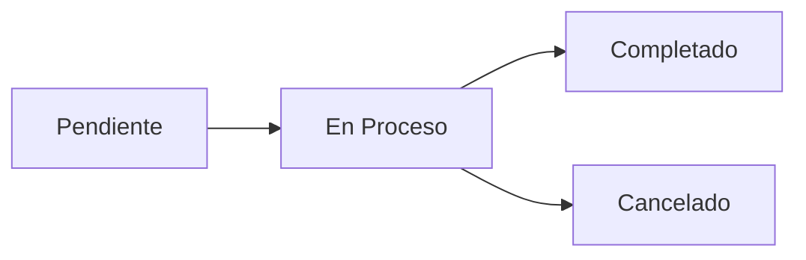

# Sistema de Gestión de Librería - Ejercicio Grupal 3

<div align="center">


</div>

---

## Descripción General

Este proyecto implementa un **sistema completo de gestión para librería** enfocado en el diseño de base de datos, operaciones DDL (Data Definition Language) y manipulación de estructuras. El sistema incluye gestión integral de inventario de libros, clientes, pedidos y procesamiento de pagos con énfasis en la evolución y modificación de esquemas de base de datos.

## Características Principales

- **Diseño de Base de Datos Normalizada**
- **Operaciones DDL Avanzadas**
- **Gestión de Integridad Referencial**
- **Control de Inventario de Libros**
- **Sistema de Pedidos Completo**
- **Modificaciones Estructurales Dinámicas**

---

## Arquitectura de la Base de Datos

<div align="center">

| Entidad | Descripción | Responsabilidad |
|---------|-------------|-----------------|
| **Clientes** | Información de compradores | Gestión de usuarios |
| **Libros** | Catálogo de productos | Inventario y precios |
| **Pedidos** | Órdenes de compra | Transacciones comerciales |
| **Detalles_Pedido** | Líneas de pedido | Desglose por producto |
| **Pagos** | Transacciones financieras | Control de ingresos |

</div>

### **Relaciones del Sistema**
- **Cliente → Pedidos** (1:N): Un cliente puede tener múltiples pedidos
- **Pedido → Detalles_Pedido** (1:N): Un pedido contiene múltiples líneas
- **Libro → Detalles_Pedido** (1:N): Un libro puede aparecer en múltiples pedidos
- **Pedido → Pagos** (1:1): Cada pedido tiene un pago asociado

---

## Scripts SQL Incluidos

### 1. **Creación de Estructura**

**Archivo:** `Creacion tabla.sql`

```sql
-- Tabla principal de clientes
CREATE TABLE IF NOT EXISTS `libreria_db`.`Clientes` (
  `id_cliente` INT NOT NULL AUTO_INCREMENT,
  `nombre_cliente` VARCHAR(100) NOT NULL,
  `correo_cliente` VARCHAR(100) NOT NULL,
  `telefono_cliente` INT(10) NOT NULL,
  `direccion_cliente` VARCHAR(255) NOT NULL,
  PRIMARY KEY (`id_cliente`),
  UNIQUE INDEX `id_cliente_UNIQUE` (`id_cliente` ASC) VISIBLE
) ENGINE = InnoDB;
```

```sql
-- Catálogo de libros con control de stock
CREATE TABLE IF NOT EXISTS `libreria_db`.`Libros` (
  `id_libro` INT NOT NULL AUTO_INCREMENT,
  `titulo_libro` VARCHAR(255) NOT NULL,
  `autor_libro` VARCHAR(100) NOT NULL,
  `precio_libro` DECIMAL(10,2) NOT NULL,
  `cantidad_disponible` INT NOT NULL,
  CONSTRAINT chk_valor_positivo CHECK (cantidad_disponible > 0),
  `categoria_libro` VARCHAR(50) NOT NULL,
  PRIMARY KEY (`id_libro`)
) ENGINE = InnoDB;
```

> **Propósito:** Establece la estructura base del sistema con todas las restricciones de integridad

### 2. **Población de Datos**

**Archivo:** `Insertar datos dummies.sql`

```sql
-- Clientes de prueba
INSERT INTO `libreria_db`.`Clientes` (`nombre_cliente`, `correo_cliente`, `telefono_cliente`, `direccion_cliente`) VALUES
('María González', 'maria@email.com', 912345678, 'Av. Providencia 1234, Santiago'),
('Juan Pérez', 'juan@email.com', 987654321, 'Calle Las Condes 567, Santiago'),
('Ana López', 'ana@email.com', 956781234, 'Paseo Ahumada 890, Centro'),
('Carlos Rojas', 'carlos@email.com', 934567890, 'Av. Apoquindo 2345, Las Condes'),
('Sofía Mart', 'sofia@email.com', 923456789, 'Calle Huérfanos 456, Santiago');
```

```sql
-- Catálogo diverso de libros
INSERT INTO `libreria_db`.`Libros` (`titulo_libro`, `autor_libro`, `precio_libro`, `cantidad_disponible`, `categoria_libro`) VALUES
('Cien años de soledad', 'Gabriel García Márquez', 25999, 15, 'Ficción'),
('Fundación', 'Isaac Asimov', 22500, 12, 'Ciencia Ficción'),
('Asesinato en el Orient Express', 'Agatha Christie', 18750, 20, 'Misterio'),
('Orgullo y prejuicio', 'Jane Austen', 16990, 18, 'Romance'),
('Sapiens', 'Yuval Noah Harari', 28990, 10, 'Historia');
```

> **Propósito:** Carga datos realistas para testing y demostración del sistema

### 3. **Modificaciones Estructurales**

**Archivo:** `Modificar base de datos.sql`

```sql
-- Ampliación de campo telefónico
ALTER TABLE clientes MODIFY telefono_cliente VARCHAR(20);

-- Mayor precisión en precios
ALTER TABLE libros MODIFY precio_libro DECIMAL(10,3);

-- Agregar campo de auditoría
ALTER TABLE pagos ADD COLUMN fecha_confirmacion DATE;

-- Eliminación de tabla obsoleta
DROP TABLE detalles_pedido;
```

> **Propósito:** Demuestra evolución del esquema y adaptación a nuevos requerimientos

### 4. **Operaciones de Limpieza**

**Archivo:** `Modificacion2.sql`

```sql
-- Eliminación completa de tabla
DROP TABLE pagos;

-- Vaciado de datos manteniendo estructura
TRUNCATE TABLE pedidos;
```

> **Propósito:** Operaciones de mantenimiento y reestructuración de datos

---

## Categorías de Libros

<div align="center">

| Categoría | Descripción | Público Objetivo |
|-----------|-------------|------------------|
| **Ficción** | Literatura narrativa clásica | Lectores generales |
| **Ciencia Ficción** | Literatura especulativa | Aficionados al género |
| **Misterio** | Novelas policiacas y thriller | Amantes del suspense |
| **Romance** | Literatura romántica | Segmento específico |
| **Historia** | Ensayos y análisis históricos | Lectores académicos |
| **Infantil** | Literatura para niños | Público familiar |

</div>

---

## Estados de Pedidos

### **Flujo de Estados**



<div align="center">

| Estado | Descripción | Acciones Permitidas |
|--------|-------------|-------------------|
| **Pendiente** | Pedido creado, esperando confirmación | Modificar, Cancelar |
| **En Proceso** | Pedido confirmado, preparando envío | Cancelar, Completar |
| **Completado** | Pedido entregado y pagado | Solo consulta |
| **Cancelado** | Pedido anulado | Solo consulta |

</div>

---

## Operaciones DDL Implementadas

### **CREATE Operations**
- **Creación de tablas** con restricciones completas
- **Índices únicos** para optimización
- **Claves foráneas** con acciones referenciales
- **Constraints personalizados** (CHECK)

### **ALTER Operations**
- **MODIFY** - Cambio de tipos de datos
- **ADD COLUMN** - Expansión de estructura
- **Modificación de precisión** en campos numéricos

### **DROP Operations**
- **DROP TABLE** - Eliminación completa
- **TRUNCATE** - Vaciado eficiente de datos

---

## Integridad Referencial

### **Restricciones Implementadas**

```sql
-- Control de stock positivo
CONSTRAINT chk_valor_positivo CHECK (cantidad_disponible > 0)

-- Relaciones padre-hijo
CONSTRAINT `fk_Pedidos_Clientes`
    FOREIGN KEY (`Clientes_id_cliente`)
    REFERENCES `libreria_db`.`Clientes` (`id_cliente`)
    ON DELETE NO ACTION
    ON UPDATE NO ACTION
```

### **Políticas de Integridad**
- **ON DELETE NO ACTION**: Previene eliminación de registros referenciados
- **ON UPDATE NO ACTION**: Mantiene consistencia en actualizaciones
- **UNIQUE INDEXES**: Garantiza unicidad de identificadores
- **CHECK CONSTRAINTS**: Validación de reglas de negocio

---

## Casos de Uso del Sistema

### **Operaciones Comerciales**
- **Gestión de Catálogo**: Alta, baja y modificación de libros
- **Registro de Clientes**: Información completa de compradores
- **Procesamiento de Pedidos**: Desde creación hasta entrega
- **Control de Inventario**: Seguimiento de stock en tiempo real
- **Facturación**: Registro detallado de transacciones

### **Operaciones de Mantenimiento**
- **Evolución del Esquema**: Adaptación a nuevos requerimientos
- **Migración de Datos**: Transferencia y transformación
- **Optimización**: Índices y restructuración
- **Auditoría**: Campos de seguimiento y control

---

## Requisitos Técnicos

<div align="center">

| Componente | Versión Mínima | Recomendado | Observaciones |
|------------|----------------|-------------|---------------|
| **MySQL** | 8.0+ | 8.0.30+ | Para CHECK constraints |
| **InnoDB Engine** | Obligatorio | Última versión | Soporte FK completo |
| **Workbench** | 8.0+ | Opcional | Para diseño visual |

</div>

### **Configuración de Base de Datos**

```sql
-- Configuración recomendada
SET SQL_MODE = 'STRICT_TRANS_TABLES,ERROR_FOR_DIVISION_BY_ZERO,NO_AUTO_CREATE_USER,NO_ENGINE_SUBSTITUTION';
SET FOREIGN_KEY_CHECKS = 1;
SET UNIQUE_CHECKS = 1;
```

---

## Instrucciones de Implementación

### **1. Creación del Entorno**
```bash
# Conectar a MySQL
mysql -u root -p

# Crear base de datos
CREATE DATABASE libreria_db CHARACTER SET utf8mb4 COLLATE utf8mb4_unicode_ci;
USE libreria_db;
```

### **2. Ejecución de Scripts**
```sql
-- 1. Crear estructura
SOURCE Creacion\ tabla.sql;

-- 2. Poblar con datos de prueba
SOURCE Insertar\ datos\ dummies.sql;

-- 3. Aplicar modificaciones (opcional)
SOURCE Modificar\ base\ de\ datos.sql;

-- 4. Operaciones de limpieza (si es necesario)
SOURCE Modificacion2.sql;
```

### **3. Verificación del Sistema**
```sql
-- Verificar estructura
SHOW TABLES;
DESCRIBE Clientes;
DESCRIBE Libros;

-- Verificar datos
SELECT COUNT(*) FROM Clientes;
SELECT COUNT(*) FROM Libros;
SELECT COUNT(*) FROM Pedidos;
```

---

## Consultas de Análisis

### **Reportes de Ventas**
```sql
-- Top libros más vendidos
SELECT l.titulo_libro, l.autor_libro, COUNT(dp.id_detalle) as total_vendido
FROM Libros l
JOIN Detalles_Pedido dp ON l.id_libro = dp.Libros_id_libro
JOIN Pedidos p ON dp.Pedidos_id_pedido = p.id_pedido
WHERE p.estado_pedido = 'Completado'
GROUP BY l.id_libro, l.titulo_libro, l.autor_libro
ORDER BY total_vendido DESC;
```

### **Análisis de Clientes**
```sql
-- Clientes más activos
SELECT c.nombre_cliente, c.correo_cliente, 
       COUNT(p.id_pedido) as total_pedidos,
       SUM(p.total_pedido) as total_gastado
FROM Clientes c
JOIN Pedidos p ON c.id_cliente = p.Clientes_id_cliente
GROUP BY c.id_cliente
ORDER BY total_gastado DESC;
```

---
